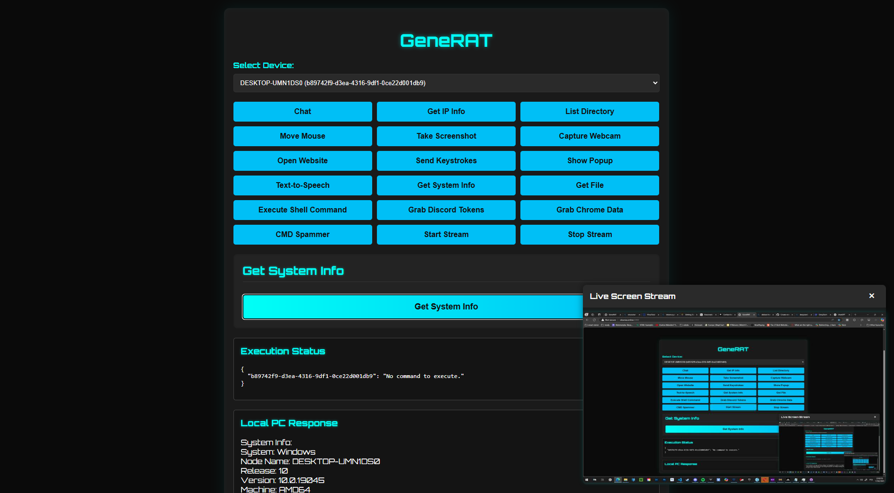

# GeneRAT - Remote Administration Tool



## ⚠️ Disclaimer

**This software is intended for educational and ethical use only.** Unauthorized access to computer systems without proper consent is illegal. The developer is not responsible for any misuse of this tool.

---

## 📌 Overview

GeneRAT is a powerful Remote Administration Tool (RAT) designed to facilitate remote system management through a **Flask-based server** and a **Python client**. It provides a **web-based dashboard** to execute commands, monitor activity, and retrieve system information seamlessly.

🔹 **Cross-platform** (Windows, Linux, MacOS)  
🔹 **Lightweight & efficient**  
🔹 **User-friendly web interface**  

---

## 🚀 Features

✅ **Remote Chat** – Send and receive messages.  
✅ **Retrieve IP Info** – Get public and local IP addresses.  
✅ **List Directory** – View remote files and folders.  
✅ **Mouse Control** – Remotely move the cursor.  
✅ **Take Screenshot** – Capture the screen in real-time.  
✅ **Capture Webcam** – Snap pictures using the webcam.  
✅ **Open Website** – Launch URLs on the remote device.  
✅ **Send Keystrokes** – Simulate keystrokes remotely.  
✅ **Show Popup** – Display alert messages.  
✅ **Text-to-Speech** – Convert text to speech.  
✅ **Retrieve System Info** – Get OS, hardware, and network details.  
✅ **File Transfer** – Upload and download files.  
✅ **Execute Shell Command** – Run commands remotely.  
✅ **Start/Stop Live Stream** – Monitor the remote screen in real time.  
✅ **Keylogger** – Log keystrokes in the background.  
✅ **Clipboard Monitor** – Read clipboard contents.  
✅ **Directory Tree** – Generate a visual directory structure.  
✅ **Discord & Chrome Data Grabber** – Extract stored tokens, passwords, and cookies.  
✅ **CMD Spammer** – Flood the screen with multiple CMD windows.  

---

## 🛠️ Installation

### 🔹 Server Setup (Flask Backend)

```sh
pip install -r requirements-server.txt
python server.py
```

Access the web panel at: [http://localhost:5000](http://localhost:5000)

### 🔹 Client Setup (Python Agent)

```sh
pip install -r requirements-client.txt
python main.py
```

---

## 🔧 Configuration

Modify **main.py** to update the **VPS_URL** variable:

```python
VPS_URL = "http://YOUR_VPS_URL:5000"
```

---

## 📜 Usage

1. **Start the Server** – Run `server.py` on the host machine.
2. **Deploy the Client** – Execute `main.py` on the target system.
3. **Control via Web Dashboard** – Use `templates/index.html` to interact with connected devices.

---

## 📂 File Structure

```
/
├── server.py        # Flask-based backend
├── main.py          # Client-side script (Python agent)
├── templates/
│   ├── index.html   # Web-based UI for controlling devices
├── styles.css       # (If applicable) UI styling
└── README.md        # Documentation
```

---

## 🛑 Legal & Ethical Considerations

**GeneRAT should only be used on devices you own or have explicit permission to control.** Unauthorized access is a criminal offense punishable by law.

---

## 👤 Author

Developed by **emkacztoja**

---

## 📄 License

This project is released under the **MIT License**.

---

🚀 **Happy Coding & Ethical Hacking!**

